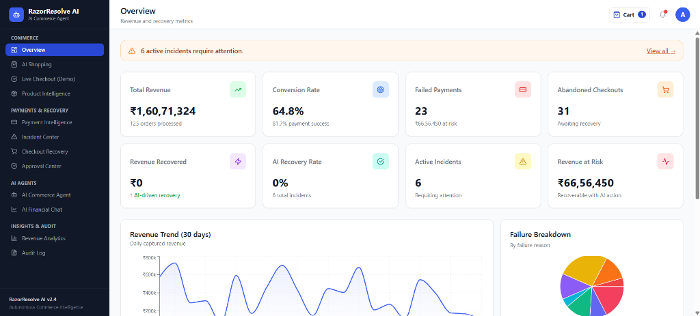
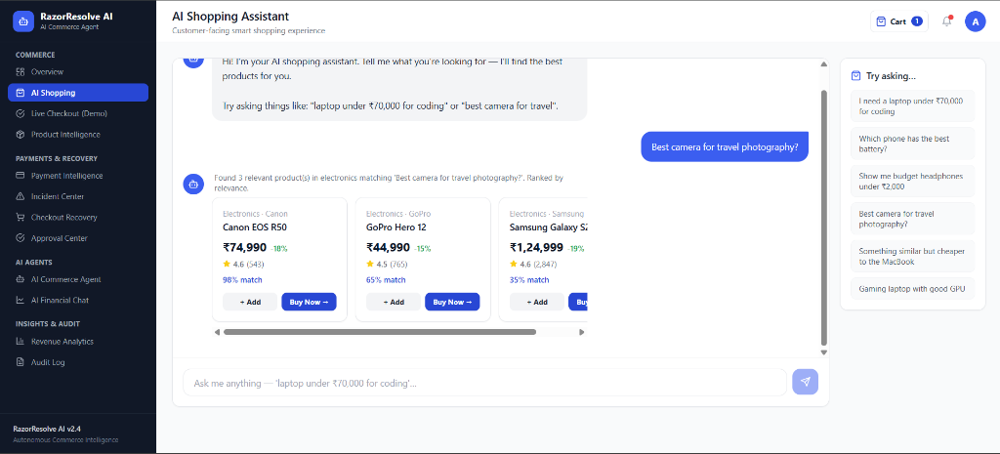
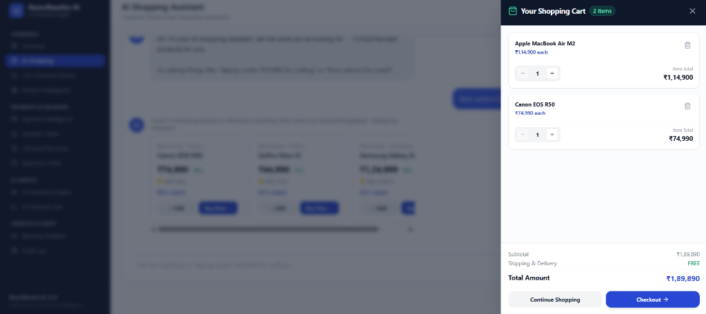
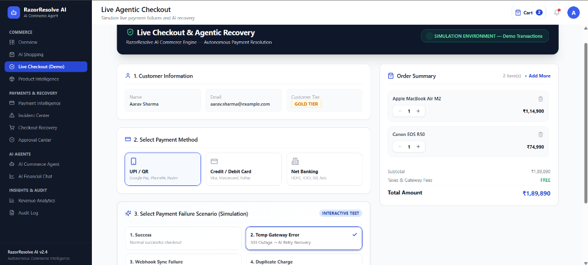
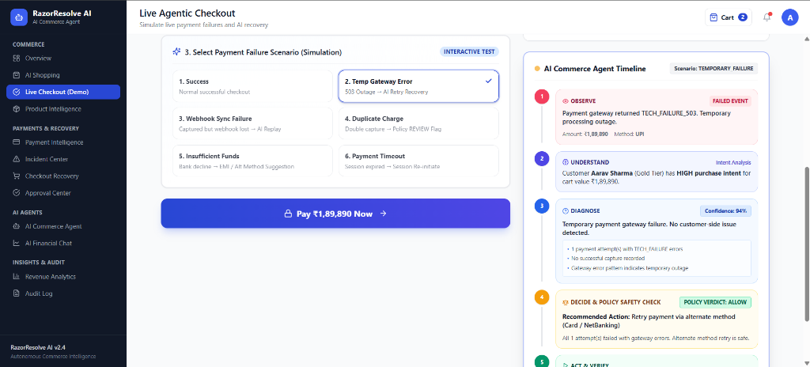

# RazorResolve AI

> An autonomous AI commerce agent that turns failed checkouts into recovered revenue.

🚀 **Live App**: [https://razor-resolve-ai.vercel.app/](https://razor-resolve-ai.vercel.app/)

---

## Demo

- **Live Application**: [https://razor-resolve-ai.vercel.app/](https://razor-resolve-ai.vercel.app/)
- **Video Demo**: [Watch the 5-minute demonstration](VIDEO_LINK_TO_BE_ADDED)

---

## Problem

E-commerce merchants lose significant revenue every day due to friction points and technical failures during checkout:
- **Failed Payments & Technical Gateway Outages**: Temporary 503 gateway errors or network timeouts cause immediate transaction failure. Traditional payment gateways return static error screens, forcing the customer to manually retry or abandon the purchase.
- **Webhook Synchronization Failures**: Payments get successfully charged at the bank, but webhook delivery fails or times out. As a result, the merchant order remains stuck in `PROCESSING`, leaving the customer frustrated and confused.
- **Risk of Duplicate Charges**: Retrying failed or pending payments automatically without safety checks can lead to double-charging customers, creating high support overhead and dispute charges.
- **Abandoned Carts**: High cart values or unexpected checkout friction lead customers to abandon their carts without completing the purchase.
- **Permanent Customer Drop-off**: Most customers leave the merchant platform permanently after a single payment failure rather than attempting manual recovery.

---

## Solution

**RazorResolve AI** is an autonomous commerce intelligence platform that actively observes checkout events, investigates transaction failures in real-time, evaluates strict safety policies, executes automated recovery actions, and maintains an explainable audit trail.

Instead of displaying generic error messages, RazorResolve AI acts as an intelligent intermediary between the customer, merchant, and payment gateway to safely recover lost revenue.



---

## Core Demo Flow

```text
Customer
   ↓
AI Shopping Assistant
   ↓
Cart
   ↓
Checkout
   ↓
Payment Event
   ↓
AI Investigation
   ↓
Policy Engine
   ↓
Recovery Action
   ↓
Verification
   ↓
Audit Trail
```

---

## Key Features

- **AI Product Discovery**: Natural language query understanding and contextual product discovery.
- **Semantic Product Search**: Relevance scoring algorithm mapping user search intent (e.g. "earphones", "laptops under ₹70,000") to product catalog items.



- **Dynamic Cart Management**: Slide-over cart drawer with inline quantity increment/decrement controls, item removal, dynamic subtotal calculations, and seamless checkout sync.


- **Agentic Checkout**: Interactive simulation environment visualizing real-time payment failure investigation and autonomous recovery across 6 scenario workflows.
- **Payment Failure Investigation**: Automated diagnostic engine analyzing status codes, error patterns, and failure logs to determine the exact root cause.
- **Gateway Failure Recovery**: Automatic alternate route re-execution for temporary 503 gateway outages.
- **Webhook Replay**: Automatic detection and single-click replay of missed webhook events to synchronize payment and order states.
- **Duplicate-Payment Safety**: High-risk financial safety guardrails detecting potential double-charges and preventing unauthorized auto-refunds or retries.
- **Human Approval Workflow**: Integrated Approval Center (`/approvals`) routing high-risk operations to human operators for review before execution.
- **Abandoned-Cart Recovery**: Customer intent scoring engine analyzing cart value, historical order frequency, and customer tier to trigger personalized recovery offers.
- **Immutable Audit Trail**: Structured, searchable audit log (`/audit`) recording every observation, policy verdict, decision score, and executed recovery action.
- **AI Financial Chat**: Natural language financial analyst assistant answering market metrics, company performance queries, and stock comparisons.
- **Stock & Company Analysis**: Company valuation cards, financial metric breakdowns, and interactive Recharts trend visualizations for Indian stocks (TCS, Infosys, Reliance, etc.).

---

## Agent Architecture

RazorResolve AI employs a multi-agent architecture where specialized agents handle dedicated responsibilities:

1. **Payment Investigation Agent**:
   - *Role*: Observes payment events and diagnoses the technical root cause of failure.
   - *Responsibility*: Parses HTTP status codes, gateway responses, and transaction telemetry (e.g., distinguishing between a temporary 503 gateway outage, an authorization timeout, or a bank decline).

2. **Policy Agent**:
   - *Role*: Evaluates safety, compliance, and financial risk guardrails before any recovery action executes.
   - *Responsibility*: Evaluates transaction parameters (amount thresholds, duplicate transaction windows, risk scores) to issue strict policy verdicts (`ALLOW`, `REVIEW`, or `BLOCK`).

3. **Commerce Agent**:
   - *Role*: Orchestrates customer shopping experience, product search, and cart actions.
   - *Responsibility*: Handles semantic search query expansion, upsell/cross-sell recommendations, and product catalog ranking.

4. **Customer Intent Agent**:
   - *Role*: Analyzes abandoned checkouts and customer engagement patterns.
   - *Responsibility*: Computes intent scores based on cart value, historical order frequency, and customer tier to determine the optimal recovery incentive.

---

## Safety Architecture

Autonomous financial actions require strict guardrails to prevent unauthorized transactions or unintended refunds. RazorResolve AI enforces a 3-tier policy model:

- **`ALLOW`**: Low-risk operations (e.g., retrying a 503 gateway outage or replaying a verified webhook) are approved for automated execution.
- **`REVIEW`**: High-risk or ambiguous operations (e.g., potential duplicate payment charges, high-value transactions above threshold) are paused immediately and routed to the **Approval Center (`/approvals`)** for human operator review and sign-off.
- **`BLOCK`**: Invalid, fraudulent, or policy-violating operations are halted completely and logged in the audit trail.

### Example: Duplicate Payment Safety Control
When a customer attempts a transaction that triggers a duplicate charge pattern (e.g., two identical captures within 3 minutes):
1. Payment Investigation Agent identifies potential duplicate charge risk.
2. Policy Agent evaluates the risk score and issues a **`REVIEW`** verdict.
3. Automated execution is suspended immediately.
4. An approval request is generated in the **Approval Center (`/approvals`)**, requiring explicit human review before any refund or adjustment is processed.

---

## Example Agentic Recovery

During a **503 Gateway Failure** simulation, the system executes the complete 7-stage decision lifecycle visually in real-time:



```text
Gateway Failure
   ↓
OBSERVE       (Captures HTTP 503 status code and error telemetry)
   ↓
UNDERSTAND    (Identifies payment event context and transaction ID)
   ↓
DIAGNOSE      (Diagnoses temporary gateway outage with 94% confidence)
   ↓
DECIDE        (Formulates recovery plan: retry via alternate gateway route)
   ↓
POLICY CHECK  (Policy Agent evaluates risk -> Verdict: ALLOW)
   ↓
ACT           (Executes recovery transaction via secondary gateway route)
   ↓
VERIFY        (Confirms payment capture & synchronizes order state)
```



This 7-stage lifecycle represents the core demonstration of autonomous agentic governance in RazorResolve AI.

---

## Financial Intelligence

The **AI Financial Chat (`/financial`)** module provides educational financial analysis and market metric explanations:
- **TCS & Infosys Analysis**: Detailed stock valuation cards, revenue growth rates, profit margins, and key ratio breakdowns.
- **Company Comparison**: Side-by-side metric comparison tables contrasting Indian IT and commercial leaders (e.g. TCS vs. Infosys).
- **Financial Metrics Explanations**: Plain-English explanations of key financial metrics such as P/E ratio, ROE, EBITDA, EPS, and Profit Margin.
- **Interactive Trend Visualizations**: Interactive Recharts stock performance trend charts.

> **Note**: All market data, stock quotes, and financial metrics displayed within this module are **synthetic/demo market data** provided strictly for educational and demonstration purposes.

---

## Technology Stack

### Frontend
- **Framework**: React 18
- **Language**: TypeScript
- **Build Tool**: Vite
- **Styling**: Vanilla CSS + Tailwind CSS
- **State Management**: Zustand
- **Visualization**: Recharts
- **Icons**: Lucide Icons

### Backend
- **Language**: Python 3.11+
- **Web Framework**: FastAPI
- **ORM**: SQLAlchemy 2.0 (Async)
- **Validation**: Pydantic v2
- **Database Engine**: SQLite (`aiosqlite` driver) / PostgreSQL compatible

### AI & Agent Layer
- **Architecture**: Multi-agent orchestration (Payment, Policy, Commerce, Intent)
- **Safety Engine**: Deterministic policy evaluation engine (`ALLOW` / `REVIEW` / `BLOCK`)
- **Search Logic**: Keyword expansion & semantic synonym matching
- **Recovery Logic**: Deterministic state-machine workflow engine

---

## Safety & Demo Disclaimer

> **IMPORTANT NOTICE:**  
> All payment transactions, financial metrics, stock quotes, customer records, and gateway responses displayed within this application are generated using **100% synthetic/demo data**.  
>  
> - **No Production Razorpay Connection**: The application does NOT connect to Razorpay production APIs, live merchant accounts, or real payment infrastructure.  
> - **No Real Financial Transactions**: No real money, bank accounts, or credit cards are accessed or charged.  
> - **No Live Market Data**: All stock quotes and financial metrics are simulated.  
> - **No Investment Advice**: Financial chat outputs are educational analysis demonstrations only and do NOT constitute personalized investment or financial advice.

---

## Local Setup

### Prerequisites
- **Python 3.11+**
- **Node.js 18+** & **npm**

### 1. Backend Setup (FastAPI)

```bash
cd backend

# Create virtual environment (optional)
python -m venv venv
# Windows: venv\Scripts\activate
# macOS/Linux: source venv/bin/activate

# Install dependencies
pip install -r requirements.txt

# Seed synthetic database
python scripts/seed.py

# Start FastAPI server
uvicorn app.main:app --port 8000 --reload
```
*API documentation available at: `http://localhost:8000/docs`*

### 2. Frontend Setup (React + Vite)

```bash
cd frontend

# Install Node dependencies
npm install

# Start Vite development server
npm run dev
```
*Application UI available at: `http://localhost:5173`*

---

## Verification

To verify build, type safety, and database seeding:

```bash
# In frontend directory:
npx tsc --noEmit   # Must exit with 0 errors
npm run build      # Must create production build in dist/

# In root directory:
python backend/scripts/seed.py   # Re-seeds synthetic database
```

---

## Project Structure

```text
RazorResolve-AI/
├── backend/
│   ├── app/
│   │   ├── agents/          # Payment, Policy, Commerce AI agents
│   │   ├── api/routes/      # FastAPI API endpoints
│   │   ├── core/            # App configuration
│   │   ├── db/              # Database connection & session setup
│   │   ├── models/          # SQLAlchemy ORM models
│   │   └── services/        # Financial analysis service
│   ├── scripts/             # Database seed script (seed.py)
│   └── requirements.txt
├── frontend/
│   ├── src/
│   │   ├── components/      # UI layout, topbar, sidebar, cart drawer
│   │   ├── lib/             # API client & utility functions
│   │   ├── pages/           # 12 application page views
│   │   └── store/           # Zustand cart store (useCartStore.ts)
│   ├── package.json
│   ├── tsconfig.json
│   └── vite.config.ts
├── README.md
└── .gitignore
```

---

## Demo Flow

For a complete 5-minute project demonstration, follow this step-by-step sequence:

1. **Dashboard (`/`)**: Review overall commerce performance, recovered revenue, and active recovery metrics.
2. **Shopping (`/shopping`)**: Search for products using natural language (e.g. "wireless earbuds"), inspect results, and manage items in the cart drawer.
3. **Checkout (`/checkout`)**: Transition to Live Agentic Checkout with products in cart.
4. **Gateway Failure Simulation**: Select `Gateway Failure / TECH_FAILURE_503` scenario and trigger payment.
5. **AI Recovery**: Observe the 7-stage agentic decision timeline (`OBSERVE` → `UNDERSTAND` → `DIAGNOSE` → `DECIDE` → `POLICY CHECK` → `ACT` → `VERIFY`) and execute automated recovery.
6. **Duplicate Payment Simulation**: Select `Duplicate Payment` scenario to trigger safety controls.
7. **Approval Center (`/approvals`)**: Demonstrate `REVIEW` policy verdict escalating duplicate charge risk to human approval.
8. **Audit Log (`/audit`)**: Inspect the immutable audit trail detailing decision scores, agent names, and policy verdicts.
9. **Financial Chat (`/financial`)**: Query stock analysis (e.g. "Analyze TCS", "Compare TCS and Infosys") to demonstrate educational market intelligence with synthetic data disclaimers.

---

## Screenshots

### 1. Dashboard Overview


### 2. AI Shopping Assistant


### 3. Shopping Cart Drawer


### 4. Live Agentic Checkout Simulation


### 5. Autonomous Recovery & Agent Decision Timeline


---

## Limitations

This application is a proof-of-concept prototype built using synthetic/demo data and simulated payment failure events. Production deployment would require:
- Integration with live payment gateway APIs and webhook listeners
- Event-driven message streaming infrastructure (e.g., Kafka or RabbitMQ)
- Production-grade authentication, role-based access control (RBAC), and multi-tenant merchant isolation
- Persistent production database backend (PostgreSQL) with migration management (Alembic)
- Real-time observability, telemetry tracing, and advanced policy evaluation frameworks

---

## Future Scope

Realistic enhancements for future iterations of RazorResolve AI include:
- **Production Payment Gateway Integration**: Direct SDK/webhook integrations with payment service providers.
- **Real-Time Event Streaming**: Webhook streaming pipelines for sub-second event ingestion and recovery.
- **Merchant Authentication & RBAC**: Secure multi-tenant merchant accounts and permission levels.
- **Advanced Risk Models**: Machine-learning fraud and risk detection models for dynamic policy scoring.
- **Production Observability & Evaluation**: Comprehensive agent tracing and quantitative evaluation frameworks.

---

*RazorResolve AI — Autonomous Commerce Intelligence Platform*
